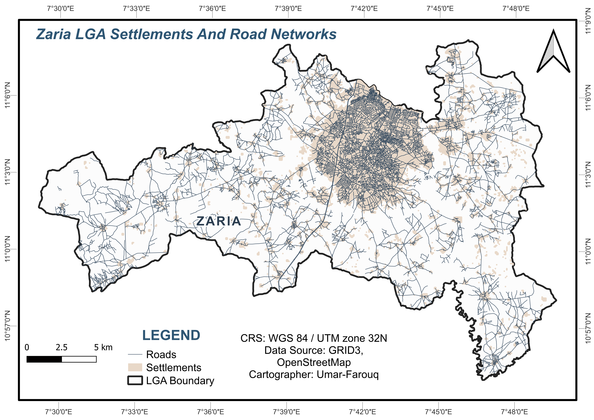

# Zaria Groundwater & Healthcare Infection Vulnerability Spatial Gap Mapping

## Project Overview

This project applies Geographic Information Systems (GIS) to assess spatial gaps in groundwater infrastructure and evaluate equitable water resource allocation across Zaria Local Government Area, Kaduna State, Nigeria. By cross-referencing functional water points with primary healthcare centers and settlement density patterns, the analysis evaluates Water, Sanitation, and Hygiene (WASH) readiness, audits institutional Infection Prevention and Control (IPC) deficits, and maps community vulnerability to crowd-accelerated and sanitation-related disease transmission.

## Main Research Question

Where are the critical spatial gaps in borehole and well coverage across Zaria Local Government Area relative to population density, and how do these deficits compound infection transmission risks at primary healthcare facilities and high-density settlements?

## Study Area

The study area is Zaria Local Government Area in Kaduna State, Nigeria. Zaria is a major urban center with surrounding peri-urban wards that rely on varying levels of formal and informal groundwater infrastructure.

*Figure 1: Spatial distribution of Settlements and Road connectivity across Zaria LGA.*

## Key Datasets & Sources

| Dataset                        | Source / Link                                                                                                                                             | Geometry Type | NOs. of Features | Key Columns                                            | Note / Gaps                                                                               | Size  | Last Updated |
| :----------------------------- | :-------------------------------------------------------------------------------------------------------------------------------------------------------- | :------------ | :--------------- | :----------------------------------------------------- | :---------------------------------------------------------------------------------------- | :---- | :----------- |
| **State Boundaries (Admin 1)** | [GRID3 NGA State Boundaries](https://data.grid3.org/datasets/GRID3::grid3-nga-operational-state-boundaries-/about)                                        | Polygon       | 37               | `statename`, `statecode`, `globalid`                   | Complete country coverage                                                                 | 1.2MB | 30 Apr 2024  |
| **LGA Boundaries (Admin 2)**   | [GRID3 NGA LGA Boundaries](https://data.grid3.org/datasets/GRID3::grid3-nga-operational-lga-boundaries/about)                                             | Polygon       | 774              | `lgaame`, `lgacode`, `statename`                       | Complete country coverage                                                                 | 4.3MB | 4 Sept 2025  |
| **Ward Boundaries (Admin 3)**  | [GRID3 NGA Wards v3.0](https://data.humdata.org/dataset/grid3-nga-operational-wards-v3-0)                                                                 | Polygon       | 5,872            | `lga`, `ward`, `ward_alt_name`, `area_sqkm`            | Only 24 states. Operational, not fully validated by govt                                  | 190MB | 5 Jul 2026   |
| **Settlement Extents v4.1**    | [GRID3 NGA Settlement Extents](https://data.grid3.org/datasets/GRID3::grid3-nga-settlement-extents-v4-0/about)                                            | Polygon       | 2,546,560        | `extent_type`, `block_area_sqm`, `building_count`      | Nationwide. Blocks derived from roads, buildings, rivers                                  | 2.0GB | 4 Aug 2026   |
| **Health Facilities v3.0**     | [GRID3 NGA Health Facilities](https://data.grid3.org/datasets/827e3638dc204f4b9ddbbd19b00954d6)                                                           | Point         | 41,778           | `facility_name`, `facility_type`, `facility_ownership` | 24 states. Non-exhaustive, operational dataset                                            | 16MB  | 14 Aug 2026  |
| **Population 2025**            | [WorldPop Nigeria 100m](https://hub.worldpop.org/geodata/summary?id=52307)                                                                                | Raster        | -----            | `population_per_pixel`                                 | Constrained 2025 estimates. ~100m resolution, WGS84, GeoTIFF                              | 158MB | 2025         |
| **Water Points**               | [WPdx Nigeria](https://data.humdata.org/m/dataset/wpdx_nga?hl=en-US) + [GRID3 Water Points](https://data.grid3.org/datasets/grid3-nga-water-points/about) | Point         | 99,246           | `water_source_tech`, `install_year`                    | Incomplete coverage. GRID3 + crowdsourced WPdx                                            | 7.5MB | 26 Jul 2026  |
| **Road Network**               | [QuickOSM - OpenStreetMap](https://www.openstreetmap.org/)                                                                                                | Line          | 7,461            | `highway`, `name`, `surface`                           | Downloaded via QGIS QuickOSM plugin. Urban areas more complete than rural. Query: Highway | ----- | 10 Sept 2026 |

## Project Goal

The project aims to use GIS spatial analysis to examine the relationship between existing water points, settlement patterns, and population density, while auditing Water, Sanitation, and Hygiene (WASH) accessibility for primary healthcare facilities. By pinpointing clinics operating without on-site or immediate functional water sources, the analysis highlights institutional IPC transmission risks and provides an evidence base for municipal drilling, public health epidemic preparedness, and targeted infrastructure maintenance.

## Expected Output

The final output will be a GIS-based spatial gap map and a React-based interactive dashboard identifying underserved neighborhoods and unserved healthcare facilities by overlaying population clusters with functional water infrastructure.

The project will be developed into an interactive web dashboard for municipal officers, hydrogeologists, and public health planners to prioritize emergency interventions and target new borehole drilling locations accurately.

## Documentation & Weekly Deliverables

- [Week 1: Project Brief & Overview](Project-Overview.md)
- [Week 2: Datasets, Notes & Inspection](Datasets.md)
- [Week 3: Data Preparation & Quality Assurance](Processed/Data_Preparation.md)
- [Week 4: Month 1 Summary Report](Month-1-Summary.md)

## Key Findings (Month 1 Analysis)

- **Healthcare IPC Vulnerability:** Out of **84** health facilities evaluated across Zaria LGA, **61.9% (52 facilities)** lack an on-site functional groundwater source within 100 meters. 
  - **32 facilities (38.1%):** Adequate on-site access ($\le$ 100 m).
  - **37 facilities (44.0%):** Moderate deficit requiring off-site hauling (100 m – 500 m).
  - **15 facilities (17.9%):** Critical IPC vulnerability located over 500 m from the nearest functional water point.
- **Ward-Level Groundwater Deficits:** Significant spatial disparities exist across administrative boundaries. **Gyellesu** and **Kufena** recorded the lowest infrastructure density with only **12 functional water points** each, followed by **Dambo**, **Limancin Kofa**, and **Tudun Wada** with 15 each.
- **Settlement Gaps:** Buffer difference modeling highlights substantial residential pockets in both peri-urban corridors and dense urban wards falling entirely outside the 500 m pedestrian walking threshold.
  

*Figure 2: Spatial distribution of healthcare IPC vulnerability tiers, 500 m groundwater walking catchments, unserved settlement gaps, and road connectivity across Zaria LGA.*

> For the comprehensive methodology, technical workflow, and data catalog, see [Month-1-Summary.md](Month-1-Summary.md).
> 
## Project Status
### Month 1

| Weeks &nbsp;&nbsp;&nbsp;&nbsp;&nbsp;&nbsp;&nbsp;&nbsp;&nbsp;&nbsp;&nbsp;&nbsp; | Achievements                                                                                                                                                                    |
| :----------------------------------------------------------------------------- | :------------------------------------------------------------------------------------------------------------------------------------------------------------------------------ |
| Week&nbsp;1                                                                    | Project definition and data feasibility completed                                                                                                                               |
| Week&nbsp;2                                                                    | Datasets downloaded, inspected and confirmed in QGIS                                                                                                                            |
| Week&nbsp;3                                                                    | Datasets reprojected to EPSG:32632 (WGS 84/UTM Zone 32N), clipped to study area and geometry validity checked. Quality Assurance completed. Saved to analysis-ready Geopackage. |
| Week&nbsp;4                                                                    | Spatial operations execution: Distance to nearest hub, 500m/1000m buffering, settlement difference/gaps, and ward-level counts.                                                 |

### Month 2 - Development environment and early Python

| Weeks &nbsp;&nbsp;&nbsp;&nbsp;&nbsp;&nbsp;&nbsp;&nbsp;&nbsp;&nbsp;&nbsp;&nbsp; | Achievements                                                                                                                                                                    |
| :----------------------------------------------------------------------------- | :------------------------------------------------------------------------------------------------------------------------------------------------------------------------------ |
| Week&nbsp;5                                                                    | Set up Python, VS Code and the terminal. Hello.py runs.                                                                                                                              |
